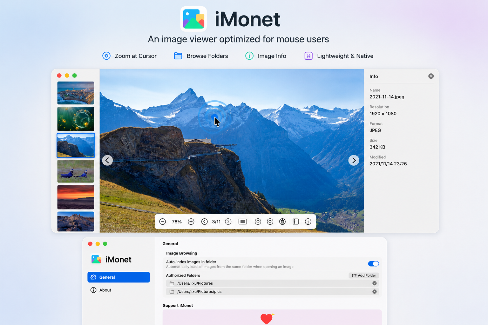

[](https://swift.org/)
[](https://developer.apple.com/xcode/swiftui/)
[](https://www.apple.com/macos/)
[](https://apps.apple.com/cn/app/imonet/id6770070921?mt=12)

<div align="center">
   
</div>

# iMonet

A modern image viewer for macOS with native animated GIF, APNG, and WebP playback. Built with SwiftUI — zero external dependencies.

[](https://apps.apple.com/cn/app/imonet/id6770070921?mt=12)

## Screenshots

<div align="center">
   
   <br/><br/>
   <table>
     <tr>
       <td></td>
       <td></td>
     </tr>
   </table>
   
</div>

## Features

### Image Browsing
- **Folder Indexing**: Automatically scans and indexes all images in the same folder
- **Persistent Permissions**: Uses security-scoped bookmarks so you only grant folder access once
- **Supported Formats**: PNG, JPEG, GIF (animated), APNG (animated), WebP (animated)
- **Animation Playback**: Frame-accurate playback with loop support, zoom/pan during animation
- **Thumbnail Sidebar**: Quick navigation strip, auto-hides when only one image is open

### Image Operations
- **Rotate**: 90° left/right rotation — display-only for animated formats, lossless file-based for static images
- **Delete**: Move to Trash with confirmation dialog
- **Print**: Print current image via standard macOS print panel
- **Copy**: Copy image path or image data to clipboard via context menu

### View Controls
- **Zoom**: Cmd + scroll wheel (centered at mouse), pinch-to-zoom trackpad gesture, toolbar zoom buttons
- **Actual Size / Fit to Window**: One-click reset
- **Pan**: Mouse drag on zoomed images

### Mouse & Keyboard
- **← / → / ↑ / ↓**: Navigate between images
- **Backspace / Forward Delete**: Delete current image
- **Cmd + O**: Open folder or image file
- **Cmd + P**: Print current image
- **Cmd + ,**: Open Settings
- **Click to Reveal**: Click image area to toggle chrome visibility, auto-hide after 5 seconds

### Floating UI
- **Bottom Toolbar**: Scale, navigation, rotation, info panel toggle, delete — auto-hides with chrome
- **Image Info Panel** (right): Pixel dimensions, file size, format, modification date
- **Navigation Arrows**: Left/right edge overlays for quick browsing
- **Dark / Light Mode**: Full adaptive theme support

### In-App Purchase
- **Yearly Support**: Annual subscription with full access to all current and future professional features
- **Lifetime Support**: One-time purchase, permanent access to all features forever
- Professional features like RAW camera format support are planned for future releases

## Requirements

- macOS 15.0 or later
- Swift 6.2+

## Build & Run

```bash
git clone https://github.com/wflixu/iMonet.git
cd iMonet
swift run
```

For a Release `.app` bundle:

```bash
xcodebuild -scheme iMonet -configuration Release -derivedDataPath build -destination "platform=macOS,arch=arm64" ARCHS=arm64 ENABLE_HARDENED_RUNTIME=YES build
```

## Project Structure

```
iMonet/
├── Sources/
│   ├── iMonetApp.swift                  # App entry point, scenes, AppDelegate
│   ├── AppState.swift                   # Global app state
│   ├── ContentView.swift                # Main layout, chrome auto-hide, rotation, delete
│   ├── NavigationIdentifier.swift       # Settings navigation identifiers
│   ├── Animator/
│   │   └── ImageAnimator.swift          # Animated GIF/APNG/WebP frame decoder
│   ├── Views/
│   │   ├── ImagePreviewView.swift       # Image loading, keyboard events, context menu
│   │   ├── ImageThumbnailView.swift     # Individual thumbnail rendering
│   │   ├── ThumbnailSidebar.swift       # Left thumbnail strip
│   │   ├── ImageInfoPanel.swift         # Right info panel (pixels, size, format, date)
│   │   ├── ToolbarView.swift            # Bottom floating toolbar
│   │   └── ZoomableImageView.swift      # Zoom & pan image view (AppKit NSView)
│   ├── Settings/
│   │   ├── GeneralSettingsPane.swift    # General preferences
│   │   ├── AboutSettingsPane.swift      # About & purchase
│   │   ├── SettingsView.swift           # Settings container
│   │   └── SettingsWindow.swift         # Settings window scene
│   ├── Store/
│   │   ├── StoreManager.swift           # StoreKit integration
│   │   ├── PurchasePromptView.swift     # Purchase prompt UI
│   │   └── UsageTracker.swift           # Launch tracking & prompt scheduling
│   ├── Permission/
│   │   └── PermissionsManager.swift     # Security-scoped bookmark management
│   └── Shared/
│       ├── AppLogger.swift              # @AppLog property wrapper
│       ├── Constants.swift              # App constants, format lists
│       └── Util.swift                   # ObjectAssociation helper
├── Tests/
│   └── iMonetTests/
├── assets/                               # README screenshots & logo
├── specs/                                # Design documents
└── Package.swift
```

## Dependencies

None — iMonet uses only Apple frameworks (SwiftUI, AppKit, ImageIO, StoreKit). Zero external dependencies.

## License

GNU General Public License v3.0 — see [LICENSE](LICENSE) for details.
